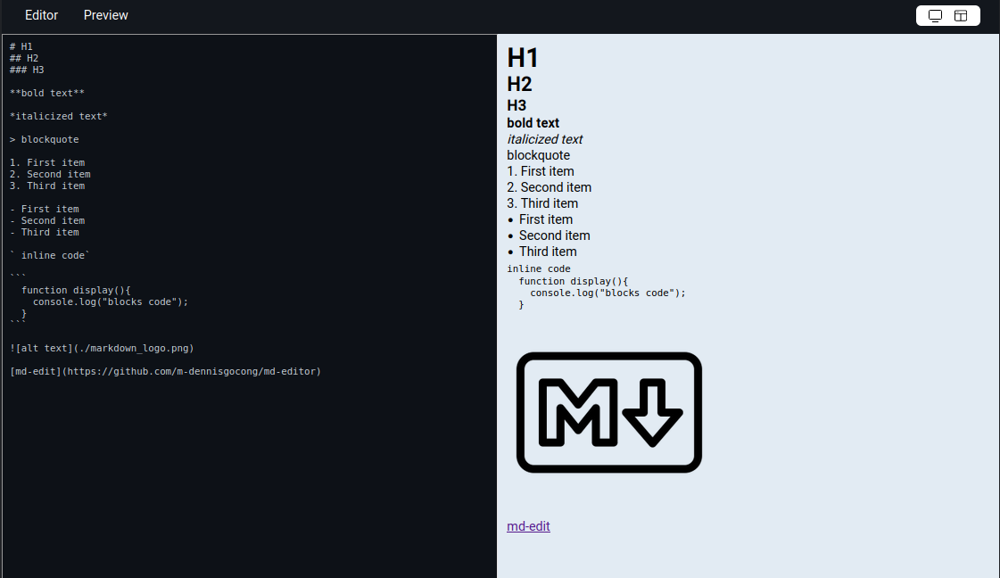

# md-editor

 

A simple markdown editor with live preview created with React

Live Demo: https://m-dennisgocong.github.io/md-editor/

## Features

- Live Preview
- Screen Type Options( split screen or single screen)
- Support Standard Markdown

## Tech Stack

- React
- SASS/SCSS
- [marked](https://marked.js.org/)
- [prismjs](https://prismjs.com/)
- Vite

## General Info

This is my project for [Front End Development Libraries](https://www.freecodecamp.org/learn/front-end-development-libraries/front-end-development-libraries-projects/) coure on freeCodeCamp. The purpose of this challenge is to test out and showcase front-end skills.

## Screenshots

## Credits

The color scheme of this project is base on github markdown editor

## Run Locally

After you clone this repo to your desktop, go to its root directory and run `npm install` to install its dependencies.

Once the dependencies are installed, you can run  `npm run dev` to start the application. You will then be able to access it at localhost

## License
>You can check out the full license [here](https://github.com/IgorAntun/node-chat/blob/master/LICENSE)

This project is licensed under the terms of the **MIT** license.

